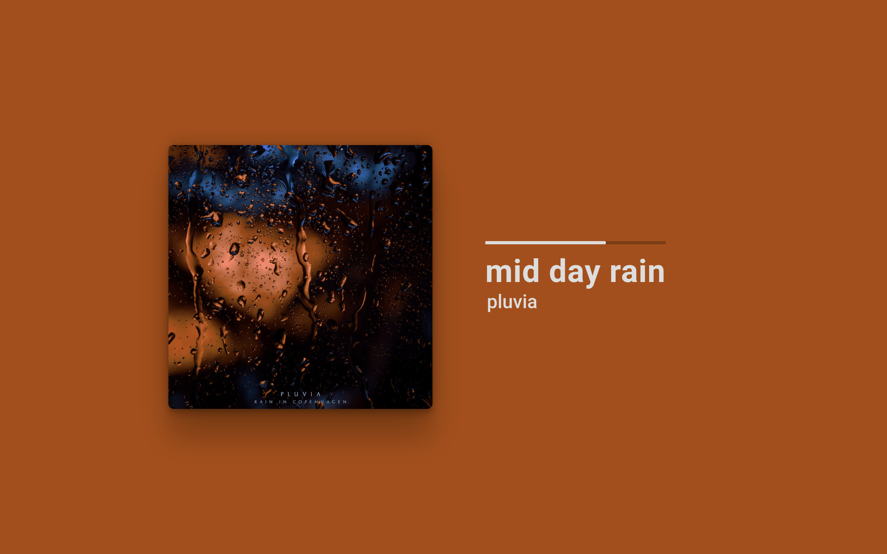
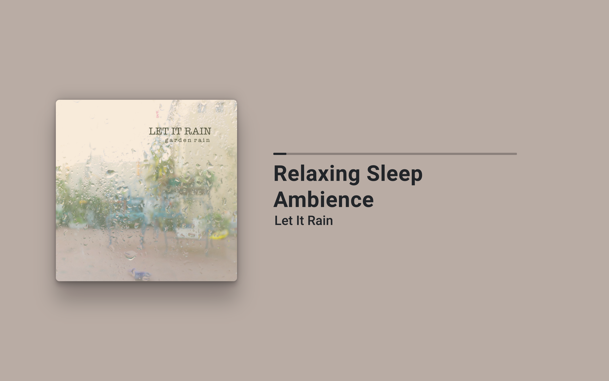
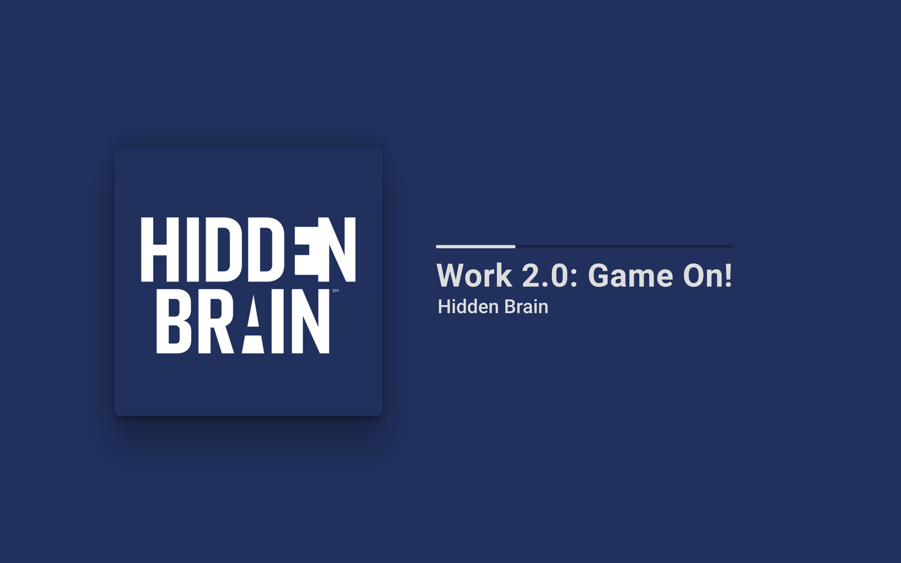

# Spotify Visualizer
Welcome to the repository for my spotify visualizer application. Unfortunately, I haven't
set up a live version of this app but I plan on doing it soon. 

## What is this app?
This simple app displays what you are currently listening to on Spotify. The color palette dynamically updates to fit well with the album cover, hopefully making a pleasant viewing experience.

It uses the Spotify API for authentication as well as fetching information about the currently playing track. 

The colors used in the app depend on the album cover of the song, dynamically updating when the song changes.

## Using this app
If you would like to run the app locally, clone this repo and run `npm install` from within the `frontend`and `server`directories. Then, you will need to create an app from the [spotify dashboard](https://developer.spotify.com/dashboard/applications), which may require spotify premium. This will provide you with a Client ID and a Client Secret. Make a file called `credentials.js` in the `server` directory and put
those two client values in that file as follows:
````
const clientId = 'thisismyclientid';
const clientSecret = 'thisismycliensecret'

module.exports = {clientId, clientSecret}
````

Then, you should be able to run the app by calling `npm start` from within `frontend` and calling `node .` from within `server`.

If that's too much, check out the screenshots below and hope I post a live version of the app soon :)

# Live Version Update
To post a live version of the app, I would need to request a manual review of the 
app by Spotify. If they approve it, any user would be able to use it rather
than just my Spotify account. However, I doubt the app would be approved since
it doesn't quite fit the developer policy that the app should `not mimic, or replicate or attempt to replace a core user experience of Spotify` ([Spotify Developer policy](https://developer.spotify.com/policy/), Section III part 11). Because of this, I will not be moving forward on posting a live version of the app :(

# Screenshots


